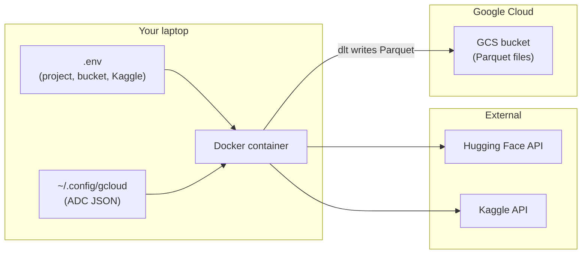
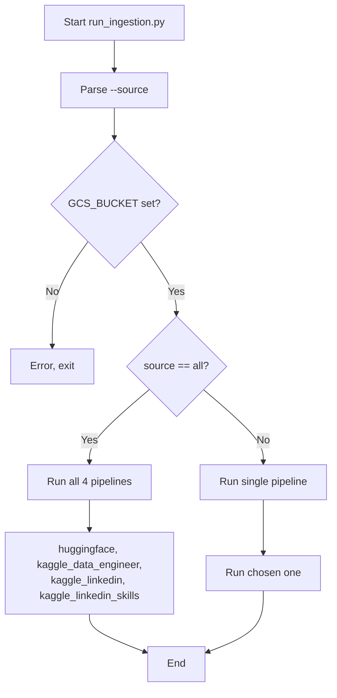
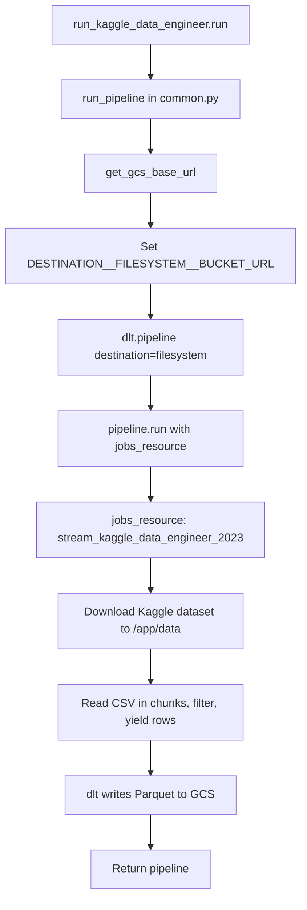
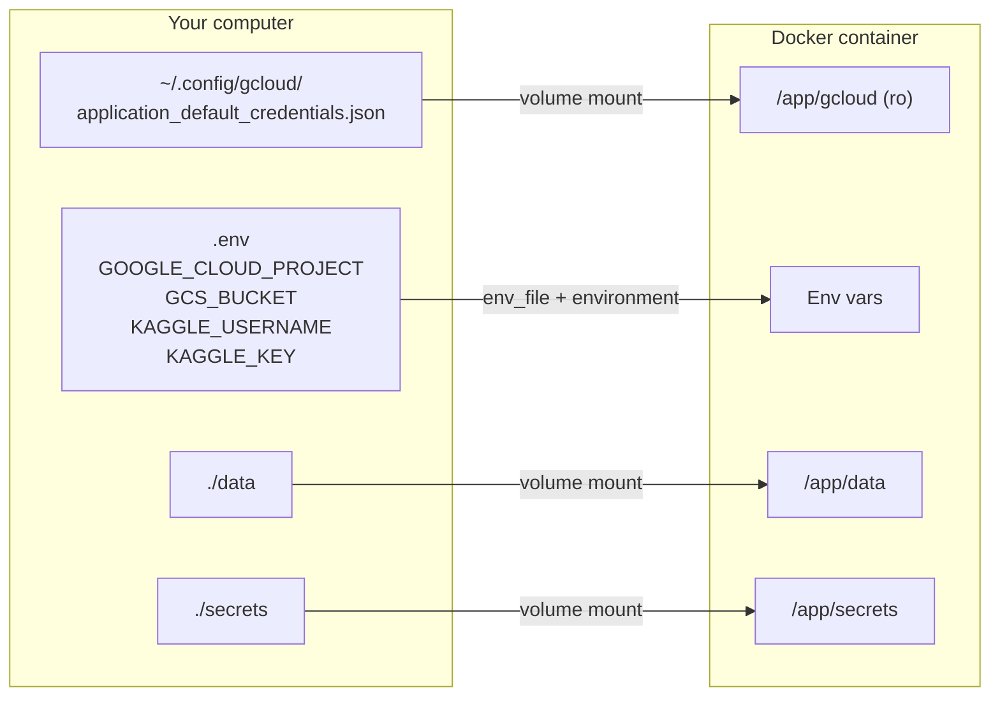
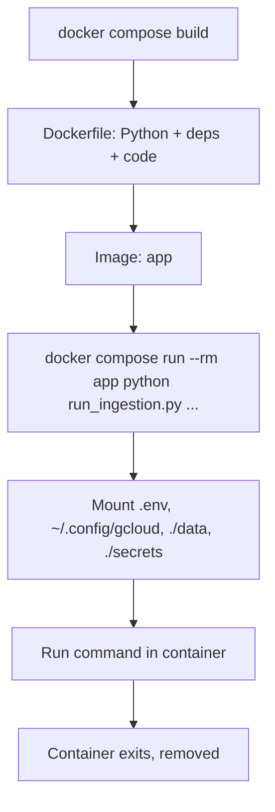

# Horizon – Mermaid Flowcharts

Use these in GitHub, VS Code (with a Mermaid extension), or any Markdown viewer that supports Mermaid.

---

## End-to-end flow

---

## run_ingestion.py decision flow

---

## Single pipeline (e.g. Kaggle Data Engineer)

---

## Where secrets live (local → container)

---

## Docker build and run

