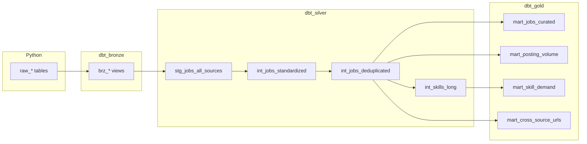

# dbt integration — Bronze / Silver / Gold

dbt runs **after** Python loads `raw_*` tables into BigQuery. It does **not** replace `run_ingestion.py` or `load_gcs_to_bigquery.py`.

**Related:** [WHEN_TO_USE_DBT.md](WHEN_TO_USE_DBT.md) · starter project in **`dbt/`**

---

## Layering (medallion)

| Layer | BigQuery dataset | Models | Role |
|-------|------------------|--------|------|
| **Bronze** | `dbt_bronze` | `brz_*` | One view per `raw_*` table — lineage from landed data, no business rules. |
| **Silver** | `dbt_silver` | `stg_*`, `int_*` | Union all sources → trim / normalize skills → **dedupe** (per `source_id` + fingerprint) → **skills long** (one row per skill). |
| **Gold** | `dbt_gold` | `mart_*` | Curated job mart, monthly volumes, skill demand, cross-source URL overlap. |



---

## Transformation logic (what the SQL does)

1. **`stg_jobs_all_sources`** — `UNION ALL` of all bronze views (single stream).
2. **`int_jobs_standardized`** — Trims text fields; builds `skills_normalized` as `ARRAY<STRING>` (see macro); `job_url_normalized` for matching.
3. **`int_jobs_deduplicated`** — `FARM_FINGERPRINT` over `source_id`, URL, title, company, `posted_date`, location; **`row_number()`** with **latest `ingested_at`** per fingerprint (per source).
4. **`int_skills_long`** — `UNNEST(skills_normalized)` for aggregations.
5. **`mart_jobs_curated`** — Gold job grain: `is_complete`, `content_quality_bucket`, `skill_count`.
6. **`mart_posting_volume`** — Monthly counts and “complete” counts by `source_id`.
7. **`mart_skill_demand`** — Skill frequency and how many sources mention it.
8. **`mart_cross_source_urls`** — Normalized URLs that appear in **more than one** `source_id`.

**Macros** (`dbt/macros/medallion.sql`): `normalize_skills_array`, `job_dedup_fingerprint` — edit there to tighten skills parsing or dedupe keys.

---

## Prerequisites

- `pip install dbt-bigquery`
- `~/.dbt/profiles.yml` from `dbt/profiles.yml.example`
- `gcloud auth application-default login`
- **Every** table in `models/sources.yml` must exist, or `dbt run` fails. Remove unused sources (e.g. `raw_jobven_jobs`) if you never load Jobven.

---

## Commands

```bash
export GOOGLE_CLOUD_PROJECT=your-project-id
export BIGQUERY_DATASET=job_market_analysis
cd dbt
dbt debug
dbt run
dbt test   # uses tests in models/gold/_gold_models.yml
```

**After each data refresh:**

```bash
python3 run_ingestion.py --source all
python3 scripts/load_gcs_to_bigquery.py --source all
cd dbt && dbt run && dbt test
```

---

## Coexistence with `create_master_table.py`

- Python script builds `master_jobs` in **`job_market_analysis`** (or your raw dataset).
- dbt builds **`project.dbt_gold.mart_jobs_curated`** (and other marts) — **prefer one** for BI to avoid confusion.
- You can stop running `create_master_table.py` once dbt is canonical.

---

## Extending further

| Idea | Where |
|------|--------|
| Incremental fact table | New `gold` model, `materialized='incremental'`, `unique_key=...` |
| JSON / string skills | Extend `normalize_skills_array` in `macros/medallion.sql` |
| Cross-source golden job ID | New `silver` model joining on `job_url_normalized` |
| dbt packages (`dbt_utils`, etc.) | Add `packages.yml`, run `dbt deps` |
| Docs / lineage | `dbt docs generate` · `dbt docs serve` |
| CI | `dbt build` with service-account profile (not ADC) |

---

## Project layout (reference)

```
dbt/
  dbt_project.yml
  profiles.yml.example
  macros/medallion.sql
  models/
    sources.yml
    bronze/brz_*.sql
    silver/stg_*.sql, int_*.sql
    gold/mart_*.sql, _gold_models.yml
```
